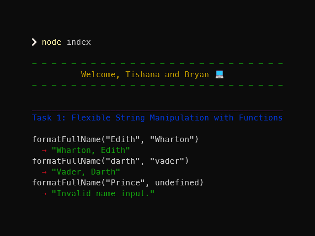

# Lab 4.1: Variables and Functions

[Karl Johnson](https://github.com/hirekarl)  
2025-RTT-30  
<date datetime="2025-06-19">2025-06-19</date>  



## Overview
### Viewer Instructions
In the root directory, run:

```bash
node index
```

*Note that text coloring may not work in Visual Studio Code's default Output pane with Run Code&mdash;run from the Terminal pane with `node`.*

### Solution
View solution source at [`./index.js`](./index.js).

### Scenario
You are tasked with writing JavaScript code for a data processing tool. This tool will handle user input, perform mathematical calculations, manipulate strings, and provide dynamic feedback based on user actions. As the team’s JavaScript expert, you need to write efficient and reusable functions to ensure your code is scalable.

In this activity, you will solve more coding challenges that involve creating and manipulating variables, using functions with multiple parameters, and handling conditional logic. The tasks will focus on making your functions more flexible and reusable, a skill that will be crucial for larger projects.


### Reflection
After completing this activity, take a few minutes to reflect on the following questions:

1. How did you approach creating more flexible functions with parameters?

**

2. What challenges did you face while incorporating conditional logic in your functions?

**

3. How does refactoring improve the readability and maintainability of your code?

**