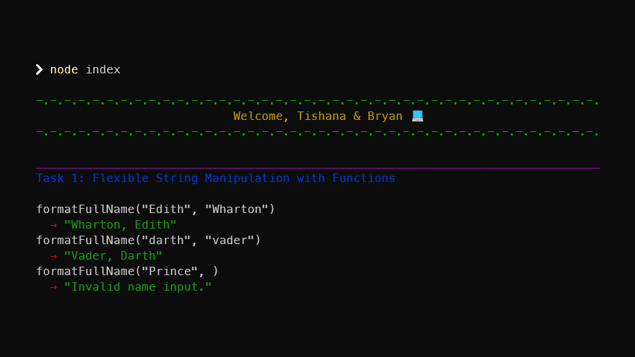

# Lab 4.1: Variables and Functions

[Karl Johnson](https://github.com/hirekarl)  
2025-RTT-30  
<date datetime="2025-06-19">2025-06-19</date>  



## Overview
### Viewer Instructions
In the root directory, run*:

```bash
node index
```

*\*Note that custom text colors (implemented with ANSI escape sequences) may not work in Visual Studio Code's default Output pane with Run Code&mdash;run from the Terminal pane with `node index`.*

### Solution
View solution source at [`./index.js`](./index.js).

### Scenario
You are tasked with writing JavaScript code for a data processing tool. This tool will handle user input, perform mathematical calculations, manipulate strings, and provide dynamic feedback based on user actions. As the team’s JavaScript expert, you need to write efficient and reusable functions to ensure your code is scalable.

In this activity, you will solve more coding challenges that involve creating and manipulating variables, using functions with multiple parameters, and handling conditional logic. The tasks will focus on making your functions more flexible and reusable, a skill that will be crucial for larger projects.

### Lab Instructions
#### Task 1: Flexible String Manipulation with Functions
1. Create a function called `formatFullName` that takes two parameters: `firstName` and `lastName`. The function should return the full name in the format `lastName, firstName`.
2. Format the `firstName` and `lastName` so that the first letter of each is always capatilized.
3. Add a condition that checks if either the first or last name is missing. If so, return a string saying `"Invalid name input."`

#### Task 2: Mathematical Operations with Multiple Parameters
1. Write a function called `calculateTotalCost` that takes three parameters: `price`, `quantity`, and `taxRate`.
2. The function should calculate the total cost of items, including tax. Use the formula: ```totalCost = (price * quantity) * (1 + taxRate)```
3. Ensure that `price`, `quantity`, and `taxRate` are all valid numbers. If any are invalid, return a string: `"Invalid input."`

#### Task 3: Functions with Conditional Logic
1. Write a function called `checkEligibility` that takes two parameters: `age` and `isEmployed`. The function should check if a person is eligible for a program based on the following rules:
  - If the person is over 18 and employed, they are eligible.
  - If the person is over 18 but unemployed, they are conditionally eligible.
  - If the person is 18 or younger, they are not eligible.
2. Return an appropriate string message for each scenario.

#### Task 4: Refactoring for Reusability
1. Refactor the `calculateTotalCost` function from Task 2 to include an optional `discount` parameter. If the discount is provided, the function should subtract the discount from the total cost before applying tax.
2. If no discount is provided, calculate the total cost as before.

### Reflection
After completing this activity, take a few minutes to reflect on the following questions:

1. How did you approach creating more flexible functions with parameters?

I wanted to use this lab, in part, to implement learnings from the previous module, where we learned about the usefulness of utility classes in CSS frameworks. Given that we are now discussing the usefulness of modularizing code in functions, I thought it would be a good opportunity for me to practice making functions that do *only one thing*, and that return values (as opposed to producing side effects).

I also wanted to practice good documentation, code style, and presentation. My goal was to write self-documenting code that can be at least kind of understood by a non-engineer without a bunch of comments, and to organize my repo and `README.md` so they were easy to read, understand, and follow.

The instructions for these tasks asked mostly for functions that return values, but required only a few side effects on the console with `console.log()`. I split my [`index.js`](./index.js) into two sections: a first section with the functions exactly as specified; and a second section that demonstrates possible input cases and outputs for the results of running my original functions. I found an opportunity to implement some console text styling with ANSI escape sequences, and I used what we learned about utility classes in Bootstrap and Tailwind to think about how I might implement some utility classes to style text in my program output.

When refactoring my code, I applied the principle **Don't Repeat Yourself** to see where I could break bits of repeated code into helper functions, and it seemed prudent to modularize my work on [./utilities/colorize.js](./utilities/colorize.js) and [./utilities/decorations.js](./utilities/decorations.js) in a [./utilities/](./utilities/) subdirectory. I also found an opportunity to practice implementing **higher-order functions** to put wrappers around my demo functions with `demoFunction()`. Maybe this use case is too verbose, but it was helpful for me to, in the end, see the demo section split in half: with the function declarations coming first, and everything related to presenting the output to the terminal below in a series of `console.log()` statements. These `console.log()`s make it explicit that the console side effects in this program are only taking place at the highest level.

2. What challenges did you face while incorporating conditional logic in your functions?

I initially had trouble remembering the sequence for elements in a ternary conditional statement in JavaScript for `checkEligibility()`, and I had to work at the nested `if...else` to be sure I was accounting for all given cases. I first implemented the `if...else` clause with a check for `age > 18`, but I remembered that in JavaScript, logical operations short-circuit, so I should deal with the disqualifying case first (`age <= 18`).

3. How does refactoring improve the readability and maintainability of your code?

Refactoring provides an opportunity to discard repeated information, which clutters a codebase and can (eventually) impede performance. It's also an opportunity rename variables, functions, and parameters so their purpose, inputs, and outputs are easy to understand. It was useful to implement the ugly-duckling version of the program first and improve as I iterated&mdash;it allowed me to first think about what functional and logical behaviors needed to be implemented, *then* come back and clarify, get more specific, abstract some stuff away, and reduce pattern repetitions wherever possible.

Regular refactoring, along with linting and testing, improve the maintainability of a codebase by ensuring code always performs as expected, communicates its behavior clearly, and provides its own paper trail for potential issues. In a corporate setting, it's prudent to maintain a codebase such that new team members can spend as little time as necessary learning the product source during onboarding.
